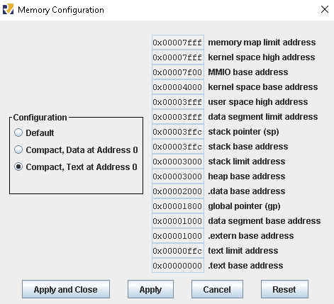
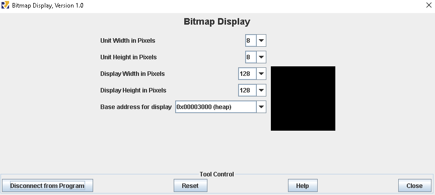

# OAC - Trabalho 3

### Aluno: Hyago Gabriel Oliveira Figueiredo

### Matrícula: 170105067

### Clonar repo:

```
https://github.com/hyagohoudini/OAC-2021.1-trab3.git
```

## COMO RODAR:

### RECOMENDAÇÃO:
#### Nome do arquivo assembler:
- trab3.asm

#### Padrão para Memory Configuration:

- Compact, Text at Address 0
- 

#### Endereço inicial do BitMap Display:

- A heap foi utilizada, logo, o endereço inicial é: **0x00003000**
- 
## Saída do Programa:

Conway's game of life passo a passo para a matriz inicial presente em mat1 no escopo .data

## Relatório:

- Descrição de funcionalidade e dos parâmetros de entrada e saída de cada função dentro do próprio arquivo .asm
### Header das funções em linguagem C

```C
void write (int a0, int a1, int* a2){
    int t6 = 16;
    a0 = a0*t6;
    a0 += a1;
    a2 += a0;
    t6 = *a2
    a0 =  t6 ^ 1;
    *a2 = a0;
}
```

```C
int readm (int a0, int a1, int* a2){
    int t6 = 16;
    a0 = a0*t6;
    a0 += a1;
    a2 += a0;
    a0 = *a2;
    return a0;
}
```

```C
void config (){
    int *t1 =  0x00003000;
    int *t2 =  0x00003400;
    string *t3 = cor;
    int t4 = &mat1;
    int s0 = &mat2;
    int *t5 = 0;
}
```

```C
void run_game (){
    // em Pseudocódigo:
    // roda enquanto o contador de etapas do jogo não chega ao fim
    // plota matriz na tela
    // julga cada uma das células
    // limpa o bitmap
    // swap as matrizes 
    // decrementa o contador 
}
```

```C
void bitmap_cleaner (){
    // em Pseudocódigo:
    // pinta em todo o bitmap a cor definida 
}
```

```C
void pixel_birth (int* s0){
    int t6 = 1;
    *s0 = 1;
}
```
```C
void pixel_death (int* s0){
    int t6 = 0;
    *s0 = 1;
}
```
```C
void cell_judge (int a0, int a1, int* a2){
    // em Pseudocódigo:
    // roda enquanto a linha é diferente da última (15)
    // conta a quantidade de vizinhos 
    // julga, pela quantidade, se o pixel atual deve morrer ou viver
    // escreve o julgamento do pixel na matriz secundária
    // incrementa os contadores, tanto da posição do Bitmap Display, quanto dos ponteiros das matrizes
    // ao final de cada contagem para colunas o contador a1 (contador das colunas) volta a ser 0
}
```
```C
void plotm (int* a0){
    // em Pseudocódigo:
    // percorra a matriz apontada por a0
    // pinta no Bitmap Display cada uma das posições de memória da matriz percorrida
}
```
```C
int neighborhood (int a0, int a1, int* a2){
    // em Pseudocódigo:
    // decrementa a0 e a1 para verificar a existência de vizinhos no canto superior esquerdo
    // decrementa a0 para verificar a existência de vizinhos no canto superior
    // decrementa a0 e incrementa a1 para verificar a existência de vizinhos no canto superior direito 
    // decrementa a1 para verificar a existência de vizinhos no canto esquerdo
    // incrementa a1 para verificar a existência de vizinhos no canto direito
    // incrementa a0 e decrementa a1 para verificar a existência de vizinhos no canto inferior esquerdo
    // incrementa a0 para verificar a existência de vizinhos no canto inferior
    // incrementa a0 e a1 para verificar a existência de vizinhos no canto inferior direito
    // contabiliza a quantidade de vizinhos existentes e retorna em a0 
    return a0;
}
```
## Saída do programa no Bitmap:
 

## Indicações da plataforma utilizada:

- Interface obrigatória para execução: RARS (v1.5 utilizada para realização do trabalho)
- Sistema Operacional: Pop!\_OS 21.10
- Ambiente utilizado para programar: Visual Studio Code

## Motivo de reenvio do trabalho após a data:
- O trabalho foi enviado na data pedida, porém houve a necessidade do reenvio, um momento o arquivo principal "trab3.asm" não foi anexado em sua versão final